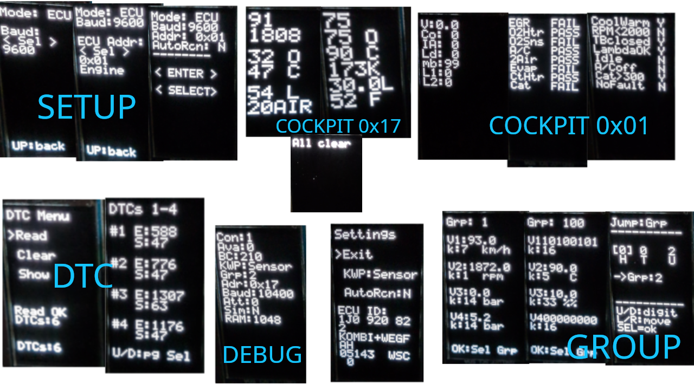

# OBDisplay-Uno

[-48.4%25_of_2048B-green)](https://github.com/RXTX4816/OBDisplay-Uno)
[-99.7%25_of_32256B-red)](https://github.com/RXTX4816/OBDisplay-Uno)

KWP-1281 K-Line trip computer for Arduino Uno with SH1107 OLED display (64×128 portrait).

Reads live sensor data and fault codes from VAG vehicles (Audi, Golf Mk4, Bora, Jetta, ~1998–2006) that use the K-Line OBD interface and the KWP-1281 protocol.

## Showcase

## Installation

Pre-built firmware is available on the [Releases](https://github.com/RXTX4816/OBDisplay-Uno/releases) page. See **[Getting Started](https://github.com/RXTX4816/OBDisplay-Uno/wiki/Getting-Started)** for flashing instructions and how to build from source.

## Features

- Full KWP-1281 implementation: 5-baud GPIO init, block send/receive, ACK, keepalive, exit
- Supported baud rates: 1200, 2400, 4800, 9600, 10400
- Supported ECU addresses: `0x01` Engine, `0x03` ABS Brakes, `0x08` Auto HVAC, `0x17` Instruments, `0x19` CAN Gateway, `0x46` Central Convenience (cockpit display with big font for `0x01`/`0x17`; others show raw group values)
- Three KWP modes: ACK (keepalive only), group read, full sensor read
- 56-case sensor decode table (full VW/Audi KWP-1281 measurement type table)
- Read and clear DTC fault codes
- SH1107 64×128 OLED display (GME64128-02), portrait orientation — pixel-doubled cockpit font, text-only rendering with batch I2C transfers

## Hardware

Needed are (estimated total cost: 10€-15€ depending on deals from chinese sellers)
- [Arduino Uno Rev3](https://www.aliexpress.com/w/wholesale-Arduino-Uno-Rev3.html)
- [KKL409 Autodia K-Line KWP1281 Diagnostic cable](https://www.aliexpress.com/w/wholesale-cable-diagnostic-kkl-409.html)
- [1,3" 64x128 vertical GME64128-02 SH1107 monochrome OLED display](https://www.aliexpress.com/w/wholesale-1%252C3-inch-oled-64-128-vertical.html) 
- [5-way joystick button](https://www.aliexpress.com/w/wholesale-5%2525252dway-joystick-button.html).

See **[Hardware Setup](https://github.com/RXTX4816/OBDisplay-Uno/wiki/Hardware-Setup)** for the full pinout, OLED wiring, button configuration, and K-Line cable modification steps.

[Guidance pictures](assets/) of my specific K-Line cable modifications in case you are unsure about where to cut and how the RX and TX lines traverse the AutoDia409 OBD adapter:

- [FT232RQ pinout picture](assets/FT232RQ_pinout.jpg)
- [KKL back modifications picture](assets/InkedKKL-cable-back_edited.jpg)
- [KKL front modifications picture](assets/InkedKKL-cable-front_edited.jpg)

## Operation

See **[Operation](https://github.com/RXTX4816/OBDisplay-Uno/wiki/Operation)** for startup, navigation, and screen overviews, or **[Screen Reference](https://github.com/RXTX4816/OBDisplay-Uno/wiki/Screen-Reference)** for per-screen layouts and button actions.

## ECU addresses and measurement groups

See **[KWP-1281 Protocol](https://github.com/RXTX4816/OBDisplay-Uno/wiki/KWP-1281-Protocol)** for ECU addresses, measurement group mappings, and protocol details.

## ECU emulator

If you don't have a car available, [OBDisplay-Emu](https://github.com/RXTX4816/OBDisplay-Emu) turns an Arduino Mega into a KWP-1281 ECU for bench testing.

## Caution

**Use at your own risk.** Wrong wiring can damage the ECU or create a fire hazard. This software only reads measurement groups and sends keepalive blocks — it does not write to or reprogram any ECU. The OBD port was designed for diagnostics only; increased workload on the ECU during driving is possible.

Do not use address `0x15` (airbag) to clear DTCs — on some affected ECUs this can deploy the airbag if an electrical fault is present in the airbag circuit.

Turn ignition ON (engine does not need to be running) before connecting.

## Development

See **[Development](https://github.com/RXTX4816/OBDisplay-Uno/wiki/Development)** for project structure, build environments, build macros, binary debug logging, display rendering details, and CI/CD.

## Credits

- [Blafusel KW1281 protocol reference](https://www.blafusel.de/obd/obd2_kw1281.html)
- [mkirbst's lupo-gti-tripcomputer-kw1281](https://github.com/mkirbst/lupo-gti-tripcomputer-kw1281)
